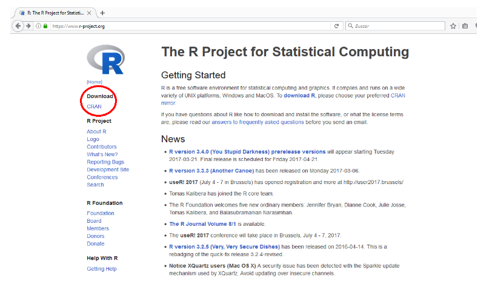
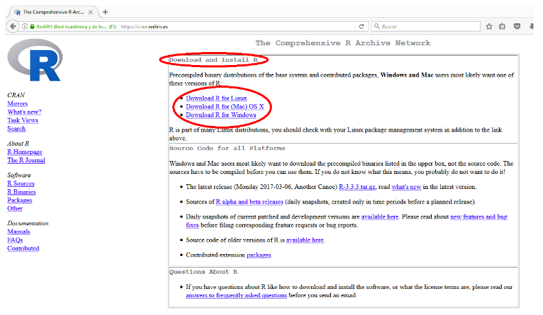
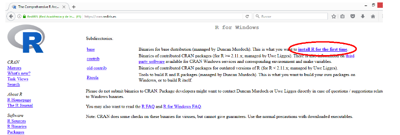
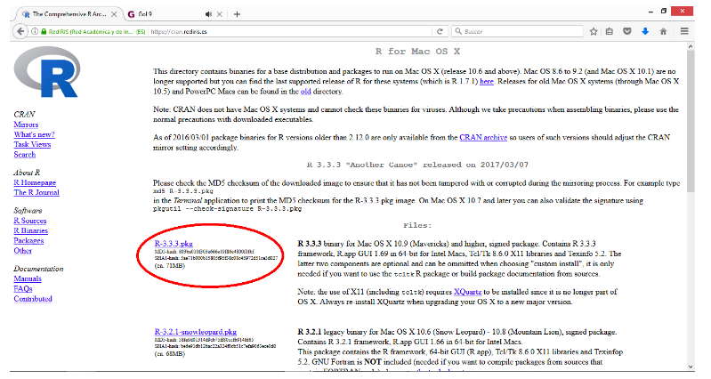
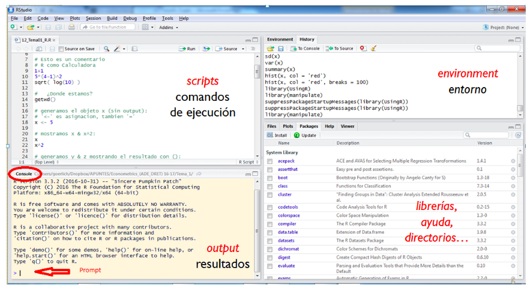
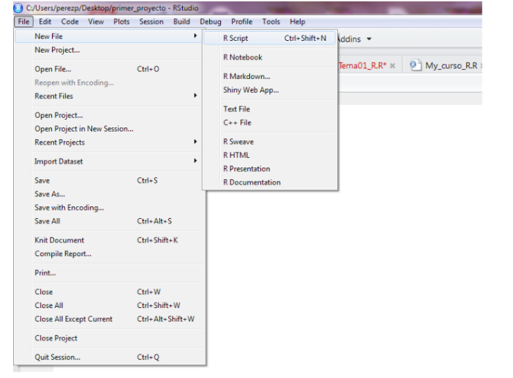
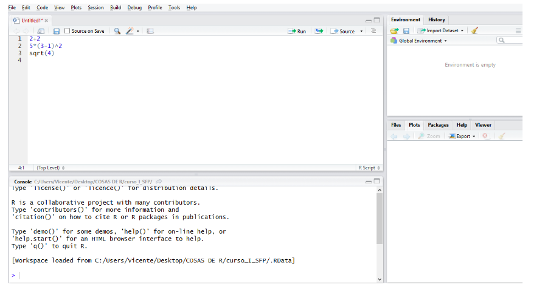
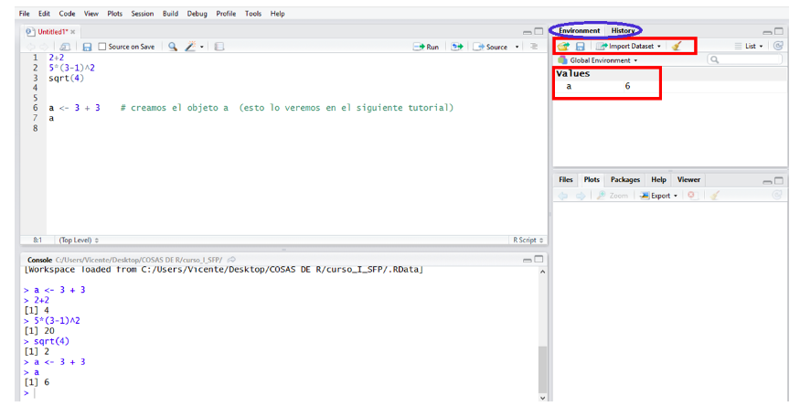
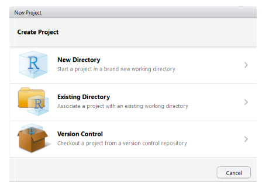
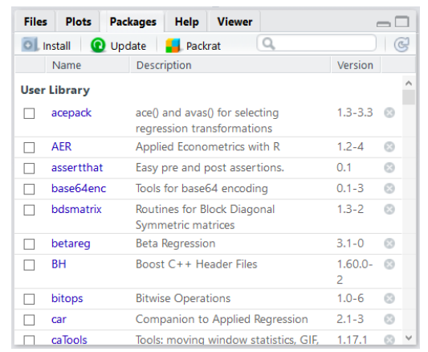

--- 
title: "AIS: Capacitación de R"
author: "Oliab Herrera Coria"
date: "`r Sys.Date()`"
site: bookdown::bookdown_site
documentclass: book
bibliography: [book.bib, packages.bib]
# url: your book url like https://bookdown.org/yihui/bookdown
# cover-image: path to the social sharing image like images/cover.jpg
description: |
  This is a minimal example of using the bookdown package to write a book.
  The HTML output format for this example is bookdown::gitbook,
  set in the _output.yml file.
link-citations: yes
github-repo: rstudio/bookdown-demo
---


# Información del curso {-}

- Este es un curso de Introducción a R.

- Al final serán capaces de utilizar R para cargar datos, arreglarlos, hacer gráficos y tablas, e informes en Rmarkdown.

- Intentaremos que el curso sea fundamentalmente práctico.

- En lugar de presentar todos los pormenores de R de manera lineal, se irán presentando distintos aspectos de R conforme se vayan necesitando; es decir, no vamos a presentar R como un lenguaje de programación sino como una herramienta para hacer análisis estadísticos.

En la carpeta del curso están todos los materiales: tutoriales, algunos datos, etc….

#### Ligas {-}
Notas: https://fastidious-brioche-36f6dd.netlify.app/
Correo: oliabherrera@gmail.com   
 


</br>


## Temario {-}

1. **Introducción a R**

-   Instalación de R y R Studio.
-   Entorno de trabajo de RStudio.
-   Instalación de paquetes.
-   Ayuda en R.  

2. **Manipulación y visualización de datos**

-   Comandos básicos de R.
-   Manipulación y limpieza de datos.
-   Visualización de datos.
-   Temas selectos de programación en R.

3. **Reportes POS**

-   Descarga de datos.
-   Scripts principales.
-   Proyecciones.


### Software {-}

- https://www.r-project.org
- https://www.rstudio.com

# Introducción a R.

El objetivo de este tutorial es familiarizarnos con el entorno de trabajo que proporciona R y RStudio. Al finalizar este tutorial también deberemos ser capaces de instalar y cargar los paquetes que vayamos a necesitar para realizar nuestros análisis de datos.

## Un poco de historia

R tiene sus orígenes en S, un lenguaje de programación creado en los Laboratorios Bell de Estados Unidos. Sí, los mismos laboratorios que inventaron el transistor, el láser, el sistema operativo Unix y algunas otras cosas más.

Dado que S y sus estándares son propiedad de los Laboratorios Bell, lo cual restringe su uso, Ross Ihaka y Robert Gentleman, de la Universidad de Auckland en Nueva Zelanda, decidieron crear una implementación abierta y gratuita de S. Este trabajo, que culminaría en la creación de R inició en 1992, teniendo una versión inicial del lenguaje en 1995 y en el 2000 una versión final estable.

En el presente, el mantenimiento y desarrollo de R es realizado por el R Development Core Team, un equipo de especialistas en ciencias computacionales y estadística provenientes de diferentes instituciones y lugares alrededor del mundo. La versión de R mantenida por este equipo es conocida como “base” y como su nombre indica, es sobre aquella que se crean otras implementaciones de R así como los paquetes que expanden su funcionalidad.

## ¿Quién usa R?

La adopción de R se debe en gran medida a que permite responder preguntas mediante el uso de datos de forma efectiva, y como es un lenguaje abierto y gratuito, se facilita compartir código, crear herramientas para solucionar problemas comunes y que todo tipo de personas interesadas en análisis estadísticos puedan participar y contribuir al desarrollo y uso de R, no sólo aquellas que tengan acceso a licencias de software cerrado.

Incluso compañías e instituciones que no tendrían ninguna dificultad para financiar el costo de licencias de software cerrado utilizan R.

R, por citar un ejemplo, es usado por **Facebook** para analizar la manera en que sus usuarios interactúan con sus muros de publicaciones para así determinar qué contenido mostrarles. Esta es una tarea muy importante en Facebook, pues las interacciones de los usuarios con publicidad y contenido pagado son la principal fuente de ingreso de esta compañía. Además de que su división de recursos humanos emplea esta herramienta para estudiar las interacciones entre sus trabajadores.

**Google** usa R para analizar la efectividad las campañas de publicidad implementadas en sus servicios, por ejemplo, los anuncios pagados que te aparecen cuando “googleas” algo. Nuevamente, esta es la principal fuente de ingresos de esta compañía. R También es usado para hacer predicciones económicas y otras actividades.

**Microsoft** adquirió y ahora desarrolla una versión propia de R llamada OpenR, que ha hecho disponible para uso general del público. OpenR es empleada para realizar todo tipo de análisis estadísticos, por ejemplo, para empatar a jugadores en la plataforma de videojuegos XBOX Live (así que puedes culpar a R cuando te tocan partidas contra jugadores mucho más hábiles que tú).

Otras compañías que usan R de modo cotidiano son American Express, IBM, Ford, Citibank, HP y Roche, entre muchas más (Bhalla, 2016; Level, 2017; Microsoft, 2014).


## Instalación de R y R Studio.

Para instalar R vamos a la página web de R project: [http://www.r-project.org](http://www.r-project.org)  



Para descargar la aplicación hacemos clic en Cran y hacemos clic sobre el enlace del “espejo” más próximo a nuestra ubicación, México. Seleccionemos la URL de, por ejemplo (https://cran.itam.mx/).



Ahora, en función del tu sistema operativo, seleccionar la correspondiente opción.




### Instalar R en Windows.

Al hacer clic sobre Download R for Windows iremos a la página que se reproduce más abajo. Hacer clic sobre *install R for the first time.*

En la siguiente ventana, hacer clic sobre *Download R 3.3.3 for Windows* y guardar el archivo de instalación.

Ejecutar el archivo descargado para proceder a la instalación de R.


### Instalar R en Mac.
Al hacer clic sobre Download R for (Mac) OS X iremos a la página que se reproduce más abajo. Hacer clic sobre install R for the first time.



Hacer clic sobre R-3.3.3.pkg y guardar el archivo de instalación. Ejecutar el archivo descargado para proceder a la instalación de R.


### Instalar RStudio
Descargamos la aplicación desde la página web de RStudio [aquí](https://posit.co/download/rstudio-desktop/) según nuestro sistema operativo de trabajo:

-  RStudio 1.0.136 - Windows Vista/7/8/10.

-  RStudio 1.0.136 - Mac OS X 10.6+ (64-bit).

Una vez guardado el archivo, lo ejecutamos para instalar RStudio. Sigue las instrucciones de instalación.

## Entorno de trabajo de RStudio.

En general trabajamos con la interfaz de RStudio antes que con la de R porque la primera es “más amigable”.

Si abrimos RStudio vamos a ver algo parecido a lo que se muestra en la siguiente imagen:



Una vez estamos en RStudio, podemos escribir y ejecutar las órdenes de varias formas:

- directamente en la consola.

- a través de un script (.R).

- con archivos Rmarkdown (.Rmd).

Como podemos ver, RStudio está (normalmente) dividido en 4 paneles.

### Consola 
Por defecto, la consola se encuentra en el panel inferior-izquierdo. ¿Vemos la pestaña que pone Console? Inmediatamente debajo aparece un texto informativo y, finalmente, el símbolo “>”. Aquí es donde R espera que le demos instrucciones. Para ejecutarlas y obtener el resultado pulsamos enter.

Vamos a hacer este ejemplo:

```{r, include = TRUE}
2+2
5*(3-1)^2
sqrt(4)

```

### Scripts
Trabajar en la consola es muy limitado ya que las instrucciones se han de introducir una a una. Lo habitual es trabajar con scripts o archivos de instrucciones. Estos archivos tienen extensión **.R**.

Se puede crear una script con cualquier editor de texto (uno de los más populares es Tinn-R), pero nosotros lo haremos desde RStudio. Para ello, seleccionamos la siguiente ruta de menús: **File > New File > R script**



El panel del script se sitúa en la parte superior-izquierda de RStudio. Ahora podemos escribir las instrucciones línea por línea. Las instrucciones las podemos ejecutar una a una o las podemos seleccionar y ejecutar en bloque. Para ejecutar las instrucciones tenemos varias alternativas:

- Hacemos clic en el botón: **Run** (botón situado en la parte derecha de las opciones del panel de script)

- Pulsamos Ctrl+r

- Ejecutamos el código desde las opciones del menú Code. Sinceramente, esto nunca lo hemos utilizado.

Como se muestra en la imagen más abajo, vamos a escribir nuestro primer script.



Para guardar el script:

- File > Save as.. y seleccionar la ruta donde se quiere guardar el fichero.

- Hacer clic en el botón Guardar que se encuentra en la parte izquierda de la cinta de opciones del script.

### Entorno

El panel de entorno esta compuesto de dos pestañas: Environment y History.

- En el Environment se irán registrando los objetos que vayamos creando en la sesión de trabajo. También tenemos la opción de cargar y guardar una sesión de trabajo, importar datos y limpiar los objetos de la sesión. Estas opciones están accesibles a través de la cinta de opciones de la pestaña.



- En la pestaña History se registran las instrucciones ejecutadas. Como opciones, podemos cargar y guardar el historial de la sesión, seleccionar una o más instrucciones y enviarlas bien a la consola bien al script, y limpiar el historial.

### Otros recursos

Con el nombre de **Otros recursos** nos referimos al panel que se encuentra en la parte inferior-derecha del escritorio de RStudio. 

En este panel cabe destacar las siguientes pestañas, cada una con diferentes opciones:

+ Files: es una especie de explorador de archivos.

+ Plots: donde se visualizan los gráficos que creamos. Entre las opciones disponibles se encuentran:
  - Zoom: para agrandar el gráfico y verlo en otra ventana.
  - Export: para exportar/guardar el gráfico. Se puede guardar el gráfico como imagen, pdf o copiarlo al portapapeles.

+ Packages: proporciona un listado de los paquetes instalados en R y los que han sido cargado en la sesión. A través de las opciones de esta pestaña podemos instalar nuevos paquetes o actualizar los existentes.

+ Help: Para obtener ayuda sobre una determinada función.

## Configuración del espacio de trabajo

Antes de comenzar a trabajar debemos fijar el directorio donde queremos guardar nuestros archivos. Básicamente, dos alternativas.

### Opción 1: Fijar directorio
Opción 1. Indicamos a R la ruta donde queremos trabajar y la fijamos con la función setwd().

```{r , include = TRUE}
#setwd("C:/ruta del directorio de trabajo")

```
Para comprobar el directorio de trabajo utilizamos la función getwd():

```{r , include = TRUE}
getwd()

```
Para obtener un listado de los archivos que contiene la ruta establecida se usa la función dir().


```{r , include = TRUE}
dir()

```

## Opción 2 : Proyecto de R.
Al crear un proyecto todos los archivos quedan vinculados directamente al proyecto. Para crear un proyecto selección **File > New project...** Se abrirá la siguiente ventana:




Para crear un proyecto en un nuevo directorio, hacemos clic en el botón New Directory. En seguida, seleccionamos el tipo de proyecto, en nuestro caso Empty Project. Ahora, asignamos un nombre al directorio (carpeta) que se va a crear y que al mismo tiempo será el nombre del proyecto de R. Para terminar, hacemos clic en el botón Create Project. Al seguir este proceso se habrá creado una carpeta en Documentos y un fichero nombre_carpeta.Rproj.

Para crear un proyecto en una carpeta que ya existe, hacemos clic en el botón Existing Directory y después seleccionamos la carpeta ayudándonos del Browse.. si fuera necesario. Una vez elegida la carpeta, clicamos en Create Project.

Para abrir un proyecto hacemos doble clic sobre el archivo con extensión .Rproj o lo abrimos desde el menú de RStudio: File > Open Project…

Ventaja de los proyectos: cualquier fichero que creemos (script de R, documento de Rmarkdown, etc.) y guardemos se guardará en la carpeta del proyecto.

## Instalación de paquetes.

R está compuesto por un sistema base, pero para extender su funcionalidad es necesario instalar paquetes adicionales.

Podemos instalar paquetes de varias formas:

- A través del menú: Tools > Install packages…

- En el escritorio de RStudio: Packages/Install. Vemos los paquetes que tenemos actualmente instalados y aquellos que se encuentran cargados.




- Utilizando la función install.packages(). El nombre del paquete que queremos instalar debe ir entre comillas.


```{r , include = TRUE}
#install.packages("dplyr") # dplyr es un paquete que se utiliza para manipular/gestionar datos

```
Una vez instalado el paquete, hay que cargarlo para poderlo utilizar. Esto se hace con la función library().

```{r , include = TRUE}
library(dplyr)

```

## Ayuda en R.

En muchas ocasiones necesitamos ayuda sobre cómo funciona una determinada función, cuáles son sus argumentos, etc. Hay varias formas de pedir la ayuda de R. Vamos a pedir la ayuda de la función mean().

```{r , include = TRUE}
help(mean)
?mean

```

Si ejecutamos directamente la función library() se abrirá una ventana listando los paquetes que tenemos instalados en R. En el escritorio de RStudio, en la pestaña Packages también tenemos en listado de paquetes instalados (organizados en dos bloques: User Library y System Library)

```{r , include = TRUE}
library()

```

Para obtener ayuda sobre un determinado paquete…

```{r , include = TRUE}
library(help="foreign")

```
Pero sin duda, una de las mejores fuentes de ayuda en R nos la proporciona internet. Bien haciendo directamente en google la búsqueda sobre el tema que estamos interesados, bien acudiendo a algunas de las muchas webs que ofrecen ayuda. Algunas de las más populares y recomendables son:

- [R-Bloggers](https://www.r-bloggers.com/)

- [Stack Overflow](https://stackoverflow.com/)


# Comandos básicos de R.

## Introducción

El objetivo de este tutorial es familiarizarnos con los conceptos básicos de R. ¿Qué es un objeto en R? ¿Con qué clases/tipos de objetos se trabaja en R? 
Aprenderemos a definir vectores y operar con ellos; a crear matrices, listas y data frames; a seleccionar elementos, añadir filas y columnas, etc. Como lo que se pretende es que se entienda la filosofía y la práctica del trabajo con R, todos los conceptos que se introducen se ilustran con ejemplos muy sencillos. No obstante, la selección de funciones que se realiza en este tutorial tienen una aplicación directa en el tratamiento real de datos.

Vamos a realizar paso a paso este sencillo ejercicio para introducir algunos conceptos importantes.

```{r , include = TRUE}

3+4
## [1] 7
log(10)
## [1] 2.302585
x <- 3+4  
x  # x es un vector cuya primera componente es 7. Enseguida vamos con los vectores!
## [1] 7
y = 2+6
y
## [1] 8
z <- c(x,y)
z
## [1] 7 8
mean(z)
## [1] 7.5
w <- mean(z)
w
## [1] 7.5
round(w, digits=0)
## [1] 8
```
R utiliza funciones para realizar operaciones. Una función es, por ejemplo, mean(). Para utilizar una función deben especificarse unos argumentos, que es lo que escribimos dentro de los paréntesis. En el caso de la función round() hemos especificado dos argumentos: el vector que queremos redondear (w) y el número de decimales del redondeo (digits).

**El símbolo <- es el operador para asignar. También se puede utilizar = (o menos frecuente ->), aunque es preferible utilizar el <-.**

El símbolo **#** se utiliza para introducir un comentario. **Todo lo que quede a la derecha de # no se ejecutará.**

Cuando se realiza una asignación se obtiene un objeto. Podemos ver el resultado o contenido de un objeto de varias formas. Por ejemplo, para ver qué es el objeto x podemos escribir en la consola:

- x

- print(x)

- (x <- 3+4)


## Vectores

Básicamente R trabaja con los siguientes tipos de objetos:

- VECTORES

- MATRICES y ARRAYS (variables indexadas)

- LISTAS

- FACTORES

- DATA FRAMES

- FUNCIONES

Empezaremos viendo los objetos más sencillos, los vectores. Poco a poco iremos viendo el resto de objetos.

La mayoría de las operaciones (+, -, *, /) y funciones en R están definidas con carácter vectorial. ¿Qué significa esto? Que R opera componente a componente.

Antes de entender el concepto “caracter vectorial”, vamos a ver cómo se define/crea un vector.

Para crear un vector se utiliza la función c() (c de concatenate). Por ejemplo:

```{r , include = TRUE}
x <- c(1,2,3,4)
x                  # x es un vector que tiene cuatro componentes

```
```{r}
y <- c(5,6,7,8)
y
```

Volvemos sobre el tema del carácter vectorial, es decir, se opera componente a componente. Pensemos, si


```{r}
z <- x + y
```

¿Qué resultado espero obtener para z?

Exacto!!! Como la operación se realiza vectorialmente (componente a componente, muy importante!) el resultado es:

```{r}
z
```


Vamos a ver si lo entendemos de verdad. Supongamos que x e y son los siguientes vectores:


```{r}
x <- c(1,2,3,4)
y <- c(1,2,3)
```

¿Qué longitud tienen los vectores x e y? Aquí la respuesta está clara, pero en aplicaciones reales utilizaríamos la función length().


```{r}
length(x)                # esta función es muy útil, conviene recordarla.
## [1] 4
length(y)
## [1] 3
```


Los vectores no tienen la misma longitud, entonces.. ¿Cuál será el resultado de z <- x + y?

```{r}
z <- x+y

z
```

R nos da un mensaje de aviso (warning), no es lo mismo que un error. Nos avisa que hay algo que no cuadra pero…realiza la operación que nosotros queremos.

Una cuestión muy importante que siempre tenemos que tener en cuenta cuando trabajamos con vectores es que en un vector sólo podemos concatenar elementos del mismo tipo. ¿Qué tipos/clases de elementos (o datos) tenemos en R?

- Carácter 

- Numéricos 
- Enteros 
- Complejos 
- Lógicos 

Veamos algunos ejemplos…

```{r}
x <- c(1,2,3,4)    # creamos el vector x
class(x)           # devuelve el tipo de objeto
```

```{r}
y <- c("a","b")
class(y)
```


```{r}
z <- c(1L,2L,3L)   # escribimos L detrás del número para obligar a que sea entero
class(z)
```

```{r}
w <- c(TRUE, F)    # en general, puede escribirse TRUE/FALSE o T/F
class(w)
```


```{r}
t <- c(1+2i, 1+3i)
class(t)
```

En los ejemplos anteriores hemos definido un vector en el que todos sus elementos eran del mismo tipo. Pero….¿qué pasa si tenemos los siguientes vectores?

```{r}
x <- c(1,2,"a")
y <- c(FALSE, 1)
z <- c("a",T)
```


¿De qué tipo son ahora los vectores x, y, z?

```{r}
class(x)
## [1] "character"
class(y)
## [1] "numeric"
class(z)
## [1] "character"
```

R ha forzado a que todos los elementos del vector sean del mismo tipo. A esto se le llama implicit coercion. Fijémonos cúal es el resultado de los vectores que hemos definido antes.


```{r}

x
y
z

```

En ocasiones somos nosotros los que estamos interesados en forzar que todos los elementos del vector sean del mismo tipo (esto es la explicit coercion). Para ello utilizamos las funciones as.numeric() , as.character(), as.logical() … Si el resultado no tiene sentido R producirá un mensaje de error o warning. Un ejemplo:


```{r}
x <- c(1,2,"a")
x
## [1] "1" "2" "a"
as.numeric(x)
## [1]  1  2 NA
as.character(x)
## [1] "1" "2" "a"
```


Por último, podemos evaluar el tipo/clase de objeto con las funciones is.numeric(), is.character(), etc.

### Acceder a un elemento de un objeto

Para seleccionar/acceder a un elemento de un objeto se suelen emplear: **[], $, [[]].**

Vamos a crear el objeto x que será un vector de cuatro componentes formado por los cuatro primeros números pares. Así:

```{r}
x <- c(2,4,6,8)
```

Si queremos acceder/seleccionar/extraer al/el segundo componente de x

```{r}
x[2]
```

### Enlistar y borrar objetos 

Las funciones ls() y objects() hacen lo mismo: listan los objetos que hemos definido en la sesión.

```{r}
ls()
```


```{r}
objects()
```

Si queremos borrar objetos utilizamos la función rm()

```{r}
rm(z)  # borramos el objeto z
ls()
```
y si estamos interesados en borrar todos los objetos que hemos definido:

```{r}
rm(list=ls()) # o también rm(list=objects())
ls()
```

#### Ejercicios

- Crea un vector x con 5 elementos numéricos. 
- Crea un vector y con 5 elementos de tipo caractér. 
- ¿De qué tipo es el siguiente vector?: 

```{r}
z <- c("32","52","6","82","12")
```

- Suma el vector x y el vector z ¿Tienes que hacer alguna transformación? 
- Multiplica el vector z por 3 y después súmalo al vector x. 


## Tipos de objetos

### Matrices

La función matrix() permite organizar los datos en una matriz con tantas filas y columnas como se indiquen.

Vamos a pedir ayuda a R sobre la función matrix()

```{r}

?matrix # una forma de obtener ayuda en R es escribiendo ? delante de la función de la que solicitamos ayuda
```


#### Cómo crear y trabajar con matrices
Una vez hemos leído en la ayuda cómo usar la función matrix, vamos a practicarlo con el siguiente ejemplo. Pero antes de ejecutarlo, pensemos en qué es lo que queremos hacer y, sobre todo, pensemos en cuál es el resultado que esperamos obtener.

```{r}
x <- matrix (data= c(1,2,3,4), nrow=2, ncol=2) # o x <- matrix (c(1,2,3,4), nrow=2, ncol=2)
x

```


Observemos que se ha creado una matrix de 2x2 (2 filas y 2 columnas) y, además, muy importante, ¿cómo se ha completado la matriz? ¡Exacto! La matriz se ha rellenado por columnas. Si queremos que se rellene por filas hay que incluir el argumento byrow en los argumentos de la función.

```{r}
y <- matrix (c(1,2,3,4), nrow=2, ncol=2, byrow=T)
y


```


Fíjense en la diferencia entre los objetos x e y.

Una forma más simple para definir una matrix es:

```{r}
y <- matrix (c(1,2,3,4), 2, 2, byrow=T)
y

```


aunque también podíamos haber omitido el argumento relativo al número de filas o de columnas, porque conocida una dimensión R completaría la matrix dados los datos con los que se trabaja.

```{r}
y <- matrix (c(1,2,3,4), 2, byrow=T)  # no especificamos nrow porque por defecto es el primer argumento después de los datos
y
```

```{r}
x <- matrix(c(1,2,3,4,5,6), ncol=3)
x
```
#### Seleccionando elementos de una matriz

Lo primero, vamos a crear el objeto A que será una matriz.

```{r}
A <- matrix(1:16,4,4)
A
```


Para seleccionar elementos de una matriz utilizamos el símbolo de los corchetes: [].

Pensemos un momento en el posible resultado de estos ejemplos antes de efectuarlos.

```{r}
A[2,3]
A[c(1,2),c(2,4)]
A[1:3,2:4]
A[1,]
A[1:2,]
A[,2:3]

```

### Listas

A diferencia de los vectores o matrices, las listas pueden contener elementos/componentes de distinto tipo. Observemos esta lista que tiene 5 componentes (pueden ser matrices, vectores, dataframes,..).

```{r}
x <- list(c(1,2,3,4), "Curso", F, 1+2i, 3L,A)
x
```


Utilizamos el doble corchete [[]] para acceder al contenido concreto de una lista.

```{r}
x[[3]]  # accedemos al tercer componente de la lista
```


```{r}
x[[1]][2] # accedemos al segundo elemento del primer componente de la lista
```

```{r}
x[[6]][1,2]
```
Vamos a crear otra lista para practicar.

```{r}
y <- list( Titulacion = c("Economía", "Sociología", "Derecho"), Edad =c(25,26,27))

y
```

Fijémonos en la diferencia de presentación de las listas x e y. Como en la lista y hemos nombrado los componentes, estos aparecen al ejecutar el objeto precedidos del símbolo $. Ahora también podemos acceder a un componente de la lista por su nombre.


```{r}
y$Titulacion
```

```{r}
y[[1]]
```


Evidentemente, también podemos realizar operaciones con listas.

```{r}
y[[2]]*3
```

#### Ejercicios

- Crea dos matrices A y B de dimensión 3x3.
- Suma las dos matrices ¿Qué obtuviste? 
- Multiplica las  las dos matrices ¿Qué obtuviste? 
- Trata de definir una matriz con valores tipo caractér. 
- Crea una lista con los siguientes elementos: un número, un vector, una matrix y una palabra. 
- Obten el elemento de la lista que es una matriz y multiplícalo por la matriz B.


### Data Frame

Los data frame se usan para almacenar datos en forma de tablas (filas / columnas), como estamos habituados en Excel, Spss, etc.

Los data frame pueden almacenar objetos/datos de distinto tipo: numéricos, carácter, … En las matrices todos los elementos tenían que ser enteros o numéricos.

Los data frame pueden entenderse como un tipo especial de lista donde cada elemento de la lista tiene que tener la misma longitud. Cada elemento de la lista sería una columna y la longitud de cada elemento de la lista serían las filas.

**Aunque normalmente los data frame los creamos al cargar/leer una base de datos (ver el tutorial), vamos crear una data frame para ver su estructura.**

```{r}
x <- data.frame(Titulacion = c("Economía", "ADE", "Sociología", "Magisterio"), Edad = c(25, 27, 25, 24))
x

```

¿Cuál es la dimensión del objeto x (que es una data frame)?

```{r}
nrow(x) # número de filas

ncol(x) # número de columnas

dim(x)  # número de filas y columnas

```


Para acceder a los elementos de un data frame utilizamos los símbolos $ o []. La forma de proceder es similar a la que se ha visto con vectores o matrices.

Si queremos seleccionar la variable Titulacion del objeto x (que es un data frame):


```{r}
x$Titulacion
```

```{r}
x[1]
```

y para seleccionar sus dos primeros elementos:

```{r}
x$Titulacion[1:2]
```

Por avanzar alguna cosas que veremos más adelante en la práctica, podemos incluir directamente una nueva variable a nuestro data frame. Por ejemplo, vamos a añadir la variable id (de identificador) al objeto x. Esto lo podemos hacer directamente utilizando el símbolo $.

```{r}
x$id <- 1:4
x
```
o podemos crear la nueva variable, por ejemplo la variable obs (de observación) y después combinarla con nuestro data frame x.

```{r}
obs <- 1:4
x <- cbind(obs,x)
x
```

#### Ver el contenido de un data frame: head y tail.

Normalmente los data frames con los que trabajamos tienen muchas filas (individuos) y muchas columnas (variables). Si directamente escribimos el nombre del objeto (data frame) para ver su contenido lo que ocurrirá es que veremos poca cosa, apenas si observaremos como R nos lista todo el contenido de forma continua. Para entender lo que queremos decir, vamos a ver el siguiente ejemplo en el que cargamos los datos EuStockMarkets. Estos datos hacen referencia al precio de cierre diario entre los años 1991 y 1998 de las principales bolsas europeas.

```{r}
data(EuStockMarkets)        # cargamos los datos EuStockMarkets
EuStockMarkets              # para ver el contenido del objeto
```

¿Hemos visto algo?

Para echar un vistazo al contenido de un data frame (en este caso EuStockMarket) suelen utilizarse las funciones head() y tail(). Por defecto, la primera permite ver las 6 primeras observaciones y la segunda las 6 últimas. También podemos indicar el número de observaciones que queremos visualizar

```{r}
head(EuStockMarkets)
```

```{r}
tail(EuStockMarkets)
```

```{r}
head(EuStockMarkets,10)
```

#### Nombres de filas/columnas
En los data frame que hemos creado las columnas representarían variables y las filas representarían individuos (observaciones).

Si las columnas de un data frame no tienen nombres (en nuestro ejemplo son Titulación y Edad), podemos incluirlos utilizando la función names(). Para incluir nombres a las filas se utiliza la función row.names()

```{r}
lista2 <- list(c("Economía", "ADE", "Sociología", "Magisterio"), c(25, 27, 25, 24))
z <- data.frame(lista2)
z

```

```{r}
# Para incluir los nombre a las columnas:
colnames(z) <- c("Titulación", "Edad")
z
```

```{r}
colnames(z)
colnames(z)[1]
colnames(z)[1]<-"Carrera"

```

```{r}
z
```

#### Eliminando valores NA
En R los valores perdidos se denotan por NA (Not Available). Cuando trabajamos con datos, una de las tareas más importantes que hay que realizar es la de limpiar la base de datos y prepararla para los posteriores análisis (lo veremos más adelante).

Vamos a hacer una breve introducción a cómo eliminar los valores NA a través del siguiente ejemplo:

```{r}
x <- c(1,2,NA,NA,5)
malos <- is.na(x)  # identificamos los NA. La función is.na() es una función lógica.
malos
```

```{r}
x[!malos]  # el símbolo ! equivale a "lo contrario". Por tanto, en esta línea estamos diciendo "de x, selecciona lo contrario de malos"
```
```{r}
x
```

Ahora supongamos que tenemos dos objetos (dos vectores), que tienen NAs, y nos queremos quedar únicamente con los casos completos. Esta situación se ilustra en el siguiente ejemplo:

```{r}
x <- c(1,2,NA,4,NA,6)
y <- c("a","b",NA,"d",NA,"f" )

completos <- complete.cases(x,y) # complete.cases() es una función lógica
completos
```

```{r}
x[completos]
```

```{r}
y[completos]
```

Por último, vamos a ver lo anterior aplicado a un caso más práctico. Cargamos los datos airquality que se encuentran en el paquete datasets y vamos a seleccionar únicamente los casos que están completos.

```{r}
data("airquality")
head(airquality)
```


```{r}
length(airquality) # nos dará el número de variables
```

```{r}
dim(airquality) # indicará el número de observaciones (filas) y de variables (columnas)
```

```{r}
summary(airquality)  # la función summary() proporciona un resumen de todas las variables de la base de datos
```

```{r}
completos <- complete.cases(airquality)  # nos dirá si tenemos datos de todas las variables para cada individuo
head(completos)
```

```{r}
datos <- airquality[completos,] # de airquality, selecciona todas las columnas de los casos completos 
head(datos)
```

```{r}
dim(datos) # observad que han sido eliminados 42 casos.
```

#### Selección de datos (Subsetting)
Vamos a aprovechar que hemos cargado los datos de airquality para recordar algunas ideas sobre la selección de datos (observaciones y/o variables) en un data frame e introducir algunas otras.

En primer lugar, seleccionamos las variables: Ozone, Solar.R y Wind.

```{r}
datos2 <- datos[,1:3]
```


Ahora, seleccionamos del objeto datos las variables: Ozone, Solar.R y Temp.

```{r}
datos3 <- datos[,c(1,2,4)]
```


Sin en lugar de seleccionar variables (columnas) estamos interesados en seleccionar individuos/observaciones (filas):

```{r}
datos4 <- datos[1:6,]
datos5 <- datos[seq(1,nrow(datos),5),] # ¿qué observaciones estamos seleccionando?
```


Para seleccionar tanto observaciones como variables no tenemos más que combinar las estrategias anteriores:

```{r}
datos6 <- datos[seq(1,nrow(datos),5), c(1,2,4)] 
```


En ocasiones estamos interesados en seleccionar los casos para los que cierta variable toma determinado valor. Por ejemplo, queremos seleccionar las variables Ozone y Temp para todas las observaciones en las que la variable Wind satisfaga un valor:

```{r}
datos7 <- datos[datos$Wind<=4, c(1,2)] 

datos8 <- datos[datos$Wind>=2 & datos$Wind<=5.1, c(1,2)] 

datos9 <- datos[datos$Wind==4 , c(1,2)] 
```


Para seleccionar subconjuntos de datos en un data frame también podemos utilizar la función subset().

```{r}
datos10 <- subset(datos, Month==5 & Day<=15, select=c(Ozone,Solar.R,Temp))

datos11 <- subset(datos, Month !=5 & Day <=15)
```

#### Ejercicio

- Carga la siguiente base de datos. 
```{r}
data <- mtcars
```

- Crea la columna "carro" y asignala al tipo de carro. Hint: utiliza la función row.names() 
- Haz un subset que contenga las variables: carro, hp, mpg, cyl. 
- Encuentra qué carros tienen un 6 o más cilindros (cyl). 
- Encuentra el promedio de caballos de fuerza (hp). 
- Encuentra qué carros tienen el mayor y el menor rendimiento (mpg). 
- Utiliza el siguiente comando `plot(data$cyl, data$mpg)`. ¿Cómo lo interpretas? 


## Manipulación y limpieza de datos.

El estándar científico para contestar preguntas o tomar decisiones es uno que
se basa en el análisis de datos. Aquí consideramos técnicas cuantitativas: 
recolectar, organizar, entender, interpretar y extraer información de 
colecciones de datos predominantemente numéricos. Todas estas tareas son partes 
del análisis de datos, cuyo proceso podría resumirse con el siguiente diagrama:


Es importante la forma en que nos movemos dentro de estos procesos en el 
análisis de datos y en este curso buscamos dar herramientas para facilitar 
cumplir los siguientes principios:

1. **Reproducibilidad**. Debe ser posible reproducir el análisis en todos sus 
pasos, en cualquier momento.

2. **Claridad**. Los pasos del análisis deben estar documentados apropiadamente, 
de manera que las decisiones importantes puedan ser entendidas y explicadas 
claramente.

Dedicaremos las primeras sesiones a aprender herramientas básicas para poder 
movernos agilmente a lo largo de las etapas de análisis utilizando R y nos 
enfocaremos en los paquetes que forman parte del 
[tidyverse](http://tidyverse.org/).

### Paquetes y el Tidyverse {-}

La mejor manera de usar R para análisis de datos es aprovechando la gran
cantidad de paquetes que aportan funcionalidad adicional. Desde
Rstudio podemos instalar paquetes (Tools - > Install packages o usar la 
función `install.packages("nombre_paquete")`). Una vez instalados, podemos
cargarlos a nuestra sesión de R mediante `library`. Por ejemplo, para cargar el
paquete `readr` hacemos:

```{r paquetes, message=FALSE}
# print(read_csv)
# Error in print(read_csv) : object 'read_csv' not found
library(tidyverse)
print(read_csv)
```

`read_csv` es una función que aporta el paquete `readr`, que a su vez está incluido en el 
*tidyverse*. 

Los paquetes se instalan una sola vez, sin embargo, se deben cargar 
(ejecutar `library(tidyverse)`) en cada sesión de R que los ocupemos.

En estas notas utilizaremos la colección de paquetes incluídos en el 
[tidyverse](https://www.tidyverse.org/). Estos paquetes de R están
diseñados para ciencia de datos, y para funcionar juntos como parte de un flujo
de trabajo. 

La siguiente imagen tomada de [Why the tidyverse](https://rviews.rstudio.com/2017/06/08/what-is-the-tidyverse/) (Joseph 
Rickert) indica que paquetes del tidyverse se utilizan para cada
etapa del análisis de datos.

```{r}
knitr::include_graphics("imagenes/tidyverse.png")
```


